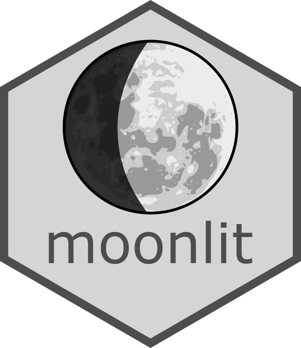

<p align="center">
  
</p>

# moonlit


R package providing biologically meaningful moonlight measures. Allows to study ecological and behavioural effects of changing moonlight intensity.
Particularly usefull in determining preference towards high or low illumination levels in different temporal scales (night, lunar cycle, seasons, years).


__This is an early release and functionalities might change. This package is currently pending a peer-review and detailed desctription will be available after it is published.__


Current functions:

- [x] Predicting moonlight intensity on the ground for any given place and time
- [x] Predicting twilight illumination levels 
- [ ] Calculating nightly mean illumianation levels for a given location - this is actually a bit tricky because you need to calculate it for each night, and not for each day. Needs including into the repository as a separate function


## Using the moonlit library
### Installing
To install from github you need devtool package

```R
#install and load devtools
install.packages("devtools")
library(devtools)

#install moonlit library from github repo
install_github("msmielak/moonlit")

#load the moonlit library
library(moonlit)
```

### Functions
#### calculateMoonlightIntensity()

Function
```R
calculateMoonlightIntensity(lat, lon, date, e)
```
requires as an input a matrix of values for location and date and a value of extinction coefficient *e* depending on the altitude.

Required formats for latitude and longitude are decimal degrees, for date it is POSIXct. Extinction coefficient *e* requires a single numerical value.

Average extinction coefficients (magnitude per air mass) are as follows:

* At sea level: 0.28
* At 500m asl: 0.24
* at 1000m asl: 0.21
* at 2000m asl: 0.16

Function returns a data frame with following columns:

* **night** - a logical value, true when sun below the horizon for given date and location
* **moonlightModel** - predicted moonlight illumination, relative to an "average" full moon
* **twilightModel** - predicted twilight illumination in lx
* **illumination** - combined moon and twilight intensity, in lx. Moonlight converted to lx based on average full moon value of 0.32 lx.
* **moonPhase** - lunar phase in numerical value - % of moon face illuminated
